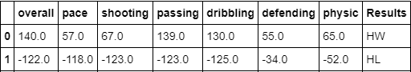
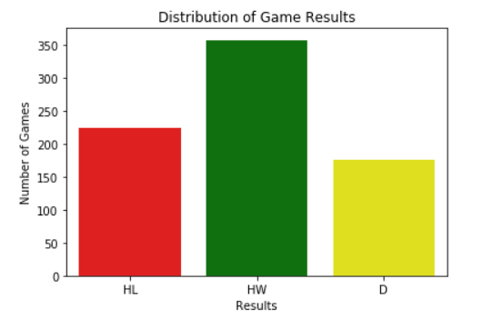
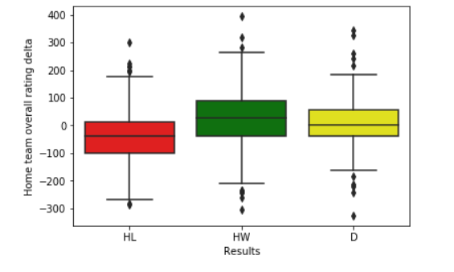
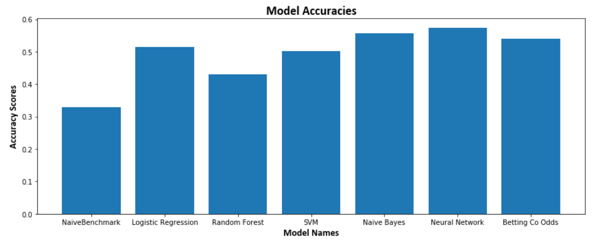

# Predicting EPL Results using FIFA Player Data
The English Premier League (EPL) is one of the most watched soccer leagues in the world. The objective of this project is to build a machine learning model which predicts results of upcoming EPL games. The idea is to assess 'strength' of a lineup by summing up FIFA game attribute scores (pace, finishing, defending etc) of the starting XI. The model will attempt to use the difference between the FIFA based 'strengths' of the two teams to predict a result. 

Tools used --> Pandas, Numpy, BeautifulSoup, TensorFlow, Keras, Scikit-learn, Matplotlib

## 1. Publicly Existing Prediction Models -
In the public sphere, there are two primary sources for game evaluations - Expected Goals (xG) model and Betting odds from bookies

### 1.1 Expected Goals (xG) model
The xG model uses historical player positioning and goals data to calculate the expected amount of goals that a team should have scored in a particular game based on where the shots were taken from. Comparing the xGs of two teams gives the prediction about what the 'expected result' should have been. While xG is very useful to evaluate the shooting efficiency of players, it does not have much predictive value as it relies on in-game data to make predictions about the same game once it's already played. 

### 1.2 Bookies odds 
Another well known source of result predictions comes from sports betting websites like Bet365, Betfair, Unibet. Every EPL game gets assigned a favorite and an underdog and the odds are used by millions of users in the betting industry. Bookies have access to extensive data and expert intelligence while framing their odds for every game and thus are often considered to be the top predictors in the result prediction business. 

## 2. Modeling Philosophy 
As already noted in the note about xG, one way to predict match results is to analyze the in-game data like shots, passes etc for patterns. While this method certainly has a use case for inference or understanding individual player performance, it lacks future predictive value as it uses live data as its predictors. So the approach followed in this project is to assess the skills of players in the starting XI and predict the result based on the relative strength of two lineups. This approach closely mirrors that of TV and social media pundits who often make their predictions after seeing the announced lineup or on a probable lineup based on known player availability news. Using the lineups to grade teams also take into account the step function impacts of players missing thru injury/suspension or players coming back. Such impacts will not be captured in models which use historical data to grade a team. 

## 3. Data Wrangling 
### 3.1 Data Sources
About 760 games worth of lineup data was web scraped from Skysports.com using the BeautifulSoup Library and the corresponding FIFA player ratings data was obtained from a publicly available database on Kaggle. 

### 3.2 Data Preparation and Cleaning
As FIFA ratings change annually with every new edition, the game lineup data from a particular season was merged with the FIFA game released at the start of the season (18-19 season player lineups merged with FIFA 19 ratings). 

The chosen features were - Overall, Pace, Shooting, Passing, Dribbling, Defending, Physical. 

These features were added up for both home and away teams and the final delta for every game was in the form of Home - Away. 
The results column was created with three results - HW (Home Win), D (Draw) and HL (Home Loss).  Sample row of the final DataFrame -

  

## 4. Data Exploration
Lets take a look at what is the distribution of game results for the dataset being used in this project - 

  

We can see that HW or Home Win is the most common result occuring about 47% of the time.

Also lets check the distribution of the "overall" rating variable vs Results - 

  

We see that Home Losses tend to occur mostly when the overall delta is negative i.e. when home team's grade on the overall rating is less than the away team. Home wins and draws are more spread out although home wins seem to tend more towards higher positive overall rating delta values. 

## 5. Machine Learning Modeling and Benchmarking 

### 5.1 Model Training

The dataset was split into training and test sets with 2/3rd data points going to the training set and rest to the test set. Using the scikit-learn library, 4 models were trained - Logistic Regression, Random Forests, Naive Bayes and Support Vector Machines (SVM). 

To create a more accurate model, TensorFlow and Keras were used to train a Neural Network. After varying the hyperparameters, the final architecture consisted of one hidden layer with 20 nodes and the optimiser used was 'Adam'. To account for variation in results, the model was run 10 times and the average accuracy was around 54%. This accuracy number was better than all the other models trained earlier. 

### 5.2 Results and Benchmarking

For a base benchmark, a naive prediction model was created which predicts each class with 33.33% rate. The accuracy of this model on the full dataset comes out to be around 32%. 

For the 'gold standard' benchmark, 10 years worth of odds data was collected for Bet365, Bet&Win and Ladbrokes. Data source was http://www.football-data.co.uk/englandm.php. The average accuracy of their predictions is around 54%. 

The xG predictions mentioned earlier are not used for benchmarking because their input data comes from in-game actions and it is used more for post game evaluations. 

The results of the machine learning models were plotted along with the benchmarks - 

  

## 6. Conclusion and Future Work

As seen in the comparison chart, the <b> Neural Network matched the accuracy level of the sports betting websites </b>, despite using far less data and having a more simplistic feature space. Naive Bayes came close second with a delta of around 1%. 

In the future, I plan to explore the following new additions to further enhance the validity and accuracy of the model - 
* Add more games to the current dataset of 760 games and explore other player attributes as candidates for additon to the feature space.
* Collapsing HL and D into a single "NoWin" category to explore possible increase in accuracy of HW predictions
* Player quality is just one piece of the puzzle when it comes to results of soccer games. For same set of lineups, results are also affected by team factors such as recent form, momentum and offensive/defensive formations. Adding these factors could improve the accuracy of the model. 

